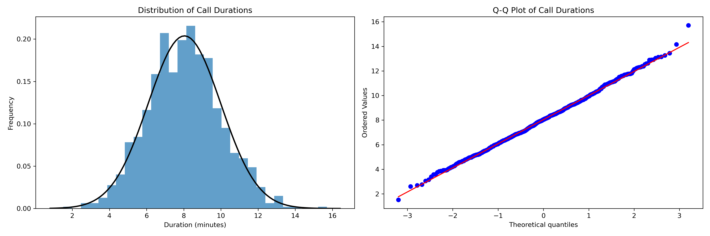

# Call Duration Analysis – Normal Distribution & Staffing

Analyzes call-center call durations assuming a normal distribution, checks Service Level Agreement (SLA) compliance, and estimates the minimum number of agents required using a simplified Erlang-C model.

## Overview

This project generates mock call duration data (mean = 8 minutes, σ = 2 minutes) and performs the following:

- Visual inspection of the distribution (histogram + normal PDF overlay)
- Q-Q plot to assess normality
- Calculation of the percentage of calls within 1σ, 2σ, and 3σ
- Probability of exceeding a 10-minute SLA target
- Simple staffing calculation based on call volume and target occupancy

## Features

- Histogram with overlaid normal distribution curve
- Quantile-Quantile (Q-Q) plot for normality check
- Empirical coverage within 1, 2, and 3 standard deviations
- SLA breach probability using the survival function
- Agent staffing estimate using a simplified Erlang-C formula

## Tech Stack

- Python 3
- NumPy
- SciPy
- Matplotlib

## Installation

```bash
pip install -r requirements.txt
## Usage
Bashpython cci.py
The script will:

Generate 1,000 normally distributed call durations
Print summary statistics and SLA metrics
Save a high-resolution plot to presentations/call_durations_analysis.png
Display the plot

## Sample Output
textMean: 8.0066
Std: 1.9622
Within 1 Std: 0.6830
Within 2 Std: 0.9550
Within 3 Std: 0.9970
Probability Exceed Target: 0.1545
Agents Needed: 5
## Visualization

The left panel shows the distribution of call durations with a fitted normal curve.
The right panel is a Q-Q plot confirming that the data closely follows a normal distribution.
